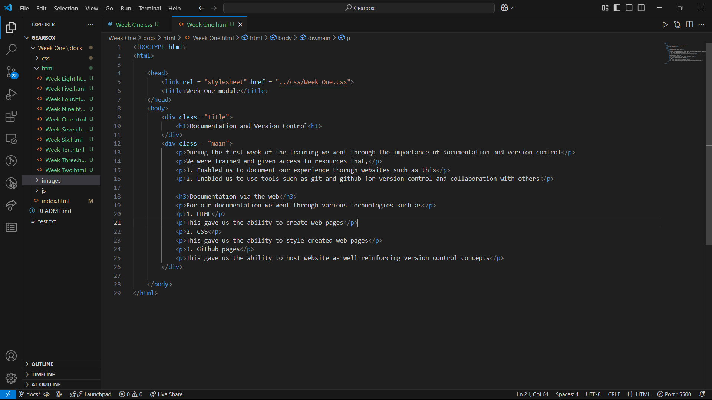
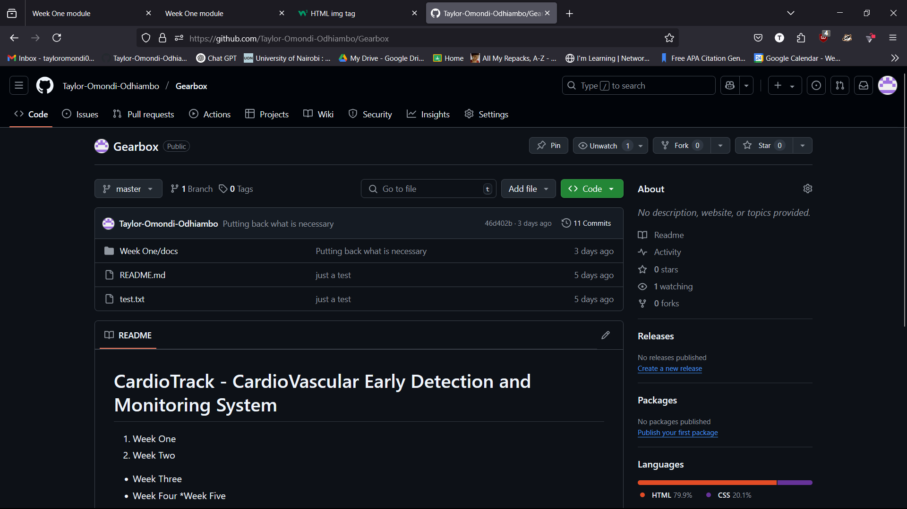
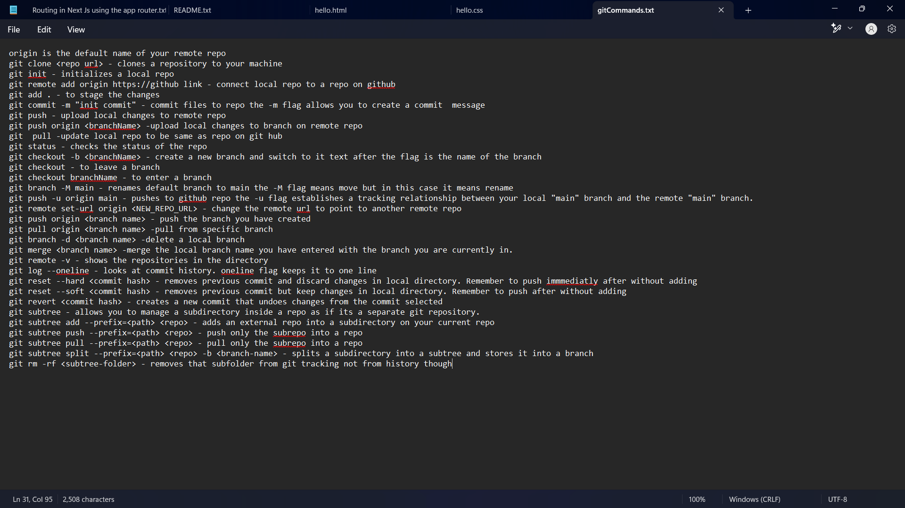

[Home](index.md)

# Documentation and Version Control
During the first week of the training we went through the importance of documentation and version control. We were trained and given access to resources that,
1. Enabled us to document our experience through websites such as this
2. Enabled us to use tools such as git and github for version control and collaboration with others

### Documentaion via the web
For our documentation we went through various technologies such :

1. HTML
This gave us the ability to create web pages

2. CSS
This gave us the ability to style created web pages

3. Github Pages
This gave us the ability to host website as well reinforcing version control concepts

# Version Control using Git and Github
We went through a comprehensive breakdown that gave us the ability to create, manage and collaborate on repositories using both the command line and the U.I

