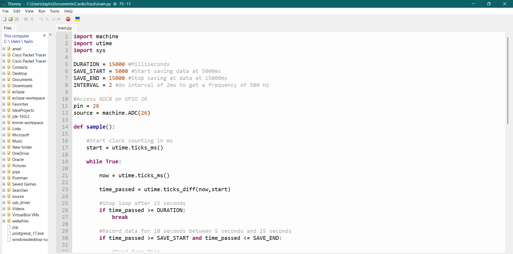
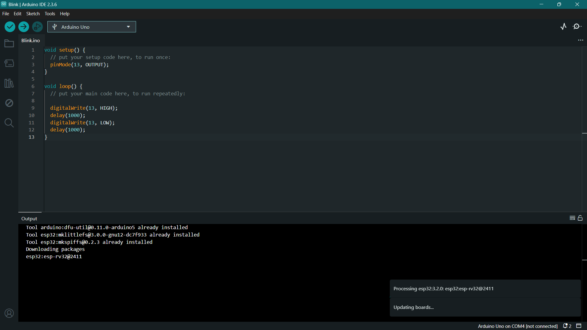
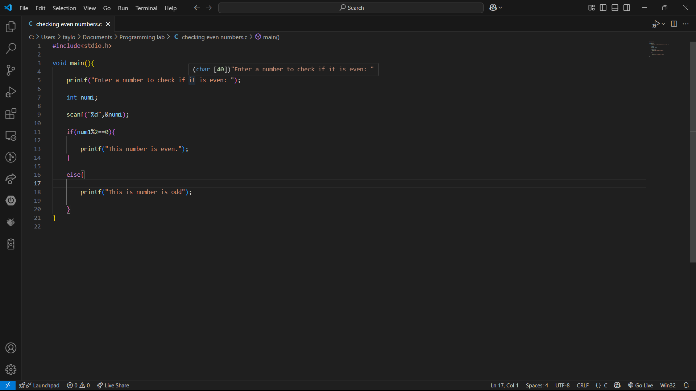

---
title:
nav_order: 3
---

# Introduction to Embedded Systems, IDEs and C
On the second week we learnt on what embedded systems are as well as an introduction to IDEs along with the programming language C.

### Embedded Systems
These are specialized computing systems devices desfinged for specific tasks. They are made up of:
- **Microcontrollers (MCUs)**: Computes on a single chip (e.g ESP32, Raspeberry Pi Pico)
- **Firmware**: This is low level software that controls the hardware
- **Peripherals**: These are additional devices that will be added to the chip e.g Sensors, actuators and communication modules.

### Integrated Developer Environments (IDEs)
These are softwares that have been created to simplify programming.
Some exapmles of IDEs for embedded systems include:

- **Thonny**
This is a beginner friendly python IDE for microcontrollers.
It is suitable for Raspberry Pi Pico and other Python based development boards.

- **Arduino IDE**
This is a beginner friendly IDE for the programming of Arduino boards.
It supports C and C++ programming with a large library of functions.

# Introduction to C and Embedded C
C is a general purpose programming language commonly used on microcontrollers and embedded systems.
We went through various concepts including:
1. Arrays
2. Functions
3. Conditional Programming
4. Loops
5. Recursion
6. Librares
7. Object Oriented Programming
We did a few exercises to reinforce these concepts.

[Back](module1.md) / [Next](module3.md)