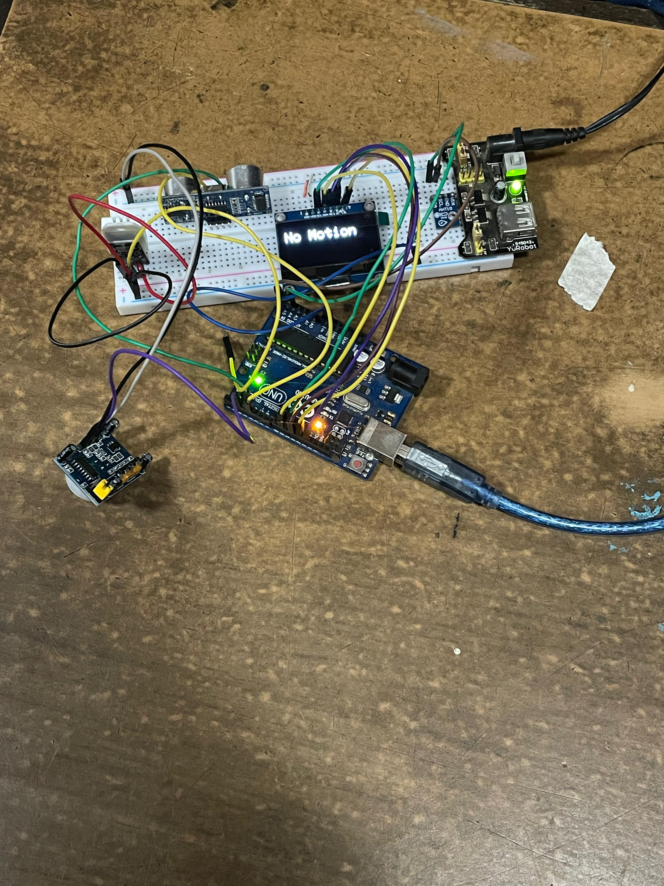

## Introduction to Sensors and Actuators

Sensors and actuators are essential for interactive embedded systems. Sensors detect changes in the physical environment and convert them into electrical signals, while actuators convert electrical inputs into mechanical action or physical output.

### 5.1 Understanding Electronic Circuits and Components

A solid grasp of circuits and their components is crucial when integrating sensors and actuators:

* **Signal Path**: How voltage and current flow through series and parallel components
* **Passive Components**: Resistors (current limiting), capacitors (signal smoothing), inductors (filtering)
* **Active Components**: Diodes (protection, rectification), transistors (switching, amplification)
* **Power Considerations**: Voltage levels, current draw, and power dissipation (P = V × I)
* **Circuit Protection**: Using resistors, diodes, and fuses to safeguard against overcurrent and voltage spikes

### 5.2 Introduction to Sensors and Actuators

**Sensors** monitor physical phenomena and output electrical signals:

* **Temperature Sensors** (e.g., DS18B20, thermistors) measure ambient heat
* **Light Sensors** (e.g., LDR, photodiodes) detect luminosity
* **Motion Sensors** (e.g., PIR, accelerometers) capture movement and orientation
* **Gas Sensors** (e.g., MQ-series) sense specific gas concentrations

**Actuators** produce physical action from electrical inputs:

* **LEDs & Displays** – Visual indicators
* **Motors & Servos** – Rotational or linear motion
* **Buzzers & Speakers** – Audio output
* **Relays & Solenoids** – Electrical switching or mechanical actuation

### 5.3 Interfacing External LEDs, Switches, and Pushbuttons with RP2040

The RP2040’s GPIO pins can drive LEDs and read button states. Example in MicroPython:

```python
from machine import Pin
import time

# LED setup on GP15
led = Pin(15, Pin.OUT)

# Pushbutton on GP14 with pull-down resistor
button = Pin(14, Pin.IN, Pin.PULL_DOWN)

while True:
    if button.value():
        led.on()      # Turn LED on when button pressed
    else:
        led.off()     # Turn LED off otherwise
    time.sleep(0.1)
```

* **Pin.OUT** configures LED pin as output.
* **Pin.IN, Pin.PULL\_DOWN** ensures reliable button reads.
* **Debounce**: Add a small delay or software filter to ignore mechanical bounce.

## Summary

This module covered the basics of circuits, introduced common sensor and actuator types, and demonstrated interfacing LEDs and buttons with the RP2040. Mastery of these elements enables responsive, real-world embedded applications.

# Mini Project


[Module 4](module4.md) - [Module 6](module6.md)
